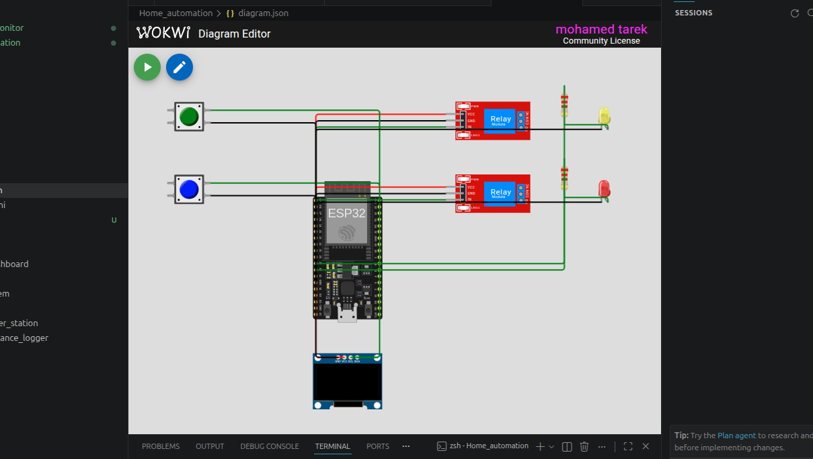

# 🏠 Home Automation System using ESP32

A simple **IoT-based Home Automation System** built with **ESP32** that allows users to control two home appliances (Light and Fan) using push buttons.

The system displays the current device states on an **SSD1306 OLED display**, controls the appliances through **relay modules**, provides visual feedback using LEDs, and stores the last device states in the ESP32's **Non-Volatile Storage (NVS)** so they are automatically restored after a restart.

---

# 📸 Simulation

<p align="center">
  
</p>

> **Note:** Save your Wokwi simulation screenshot as:

```
images/simulation.png
```

---

## 📌 Features

- 🏠 Control two home appliances (Light & Fan)
- 🔘 Push-button control
- 🔌 Relay-based switching
- 💡 LED indicators for each device
- 📺 Real-time status displayed on OLED
- 💾 Saves device states using ESP32 Preferences (NVS)
- 🔄 Automatically restores previous states after reboot
- 🖥️ Serial Monitor debugging
- ⚡ Built using the Arduino framework on ESP32
- 🧪 Fully compatible with Wokwi simulation

---

## 🛠 Hardware Components

| Component | Quantity |
|-----------|---------:|
| ESP32 DevKit V4 | 1 |
| SSD1306 OLED Display (I2C) | 1 |
| Relay Module | 2 |
| Push Button | 2 |
| LED | 2 |
| 220Ω Resistor | 2 |

---

## 🔌 Pin Connections

| ESP32 Pin | Connected Device |
|-----------|------------------|
| GPIO 15 | Button 1 (Light) |
| GPIO 4 | Button 2 (Fan) |
| GPIO 26 | Relay 1 |
| GPIO 25 | Relay 2 |
| GPIO 27 | LED 1 |
| GPIO 14 | LED 2 |
| GPIO 21 | OLED SDA |
| GPIO 22 | OLED SCL |
| 3.3V | OLED & Relay Modules |
| GND | Common Ground |

---

## ⚙️ System Operation

### Button 1

- Toggles the Light
- Updates Relay 1
- Updates LED 1
- Saves the new state
- Refreshes the OLED display

### Button 2

- Toggles the Fan
- Updates Relay 2
- Updates LED 2
- Saves the new state
- Refreshes the OLED display

---

## 💾 State Persistence

The project uses the **ESP32 Preferences Library (NVS)** to store:

- Light state
- Fan state

Whenever either device changes state:

- The new state is written to flash memory.
- After restarting the ESP32, both devices return to their previous states automatically.

---

## 📺 OLED Display

The OLED displays the current status of each controlled device.

Example:

```
HOME CONTROL

Light: ON
Fan: OFF
```

---

## 🖨 Serial Monitor Output

Example:

```
Saved Light State: OFF
Saved Fan State: ON

Home Automation Started

Light: ON
Fan: OFF

States Saved
```

---

## 📁 Project Structure

```
Home-Automation/
│
├── src/
│   └── main.cpp
│
├── images/
│   └── simulation.png
│
├── diagram.json
│
├── platformio.ini
│
└── README.md
```

---

## 📚 Libraries

The project uses the following Arduino libraries:

- Adafruit GFX Library
- Adafruit SSD1306
- Preferences (Built into ESP32 Arduino Core)

PlatformIO automatically installs the required libraries:

```ini
lib_deps =
    adafruit/Adafruit GFX Library
    adafruit/Adafruit SSD1306
```

---

## ▶️ Getting Started

### 1. Clone the repository

```bash
git clone https://github.com/yourusername/home-automation.git
```

### 2. Open with PlatformIO

Open the project using **Visual Studio Code** with the **PlatformIO** extension installed.

### 3. Build

```bash
pio run
```

### 4. Upload

```bash
pio run --target upload
```

### 5. Monitor Serial Output

```bash
pio device monitor
```

---

## 🧪 Wokwi Simulation

The project includes a complete **diagram.json** file, making it ready to run directly in **Wokwi** without additional configuration.

---

## 🚀 Possible Future Improvements

- Wi-Fi remote control
- MQTT integration
- Blynk mobile application
- Home Assistant integration
- Voice control using Google Assistant or Alexa
- Mobile notifications
- Web dashboard
- Scheduling and timers
- Energy monitoring
- Additional appliances and sensors

---

## 🛠 Technologies Used

- ESP32
- Arduino Framework
- PlatformIO
- C++
- ESP32 Preferences (NVS)
- I2C Communication
- Wokwi Simulator

---

## 📄 License

This project is intended for educational and learning purposes. Feel free to modify and extend it for your own IoT applications.

---

## 👨‍💻 Author

**Mohamed Tarek**

Engineering Student | DevOps Engineer 