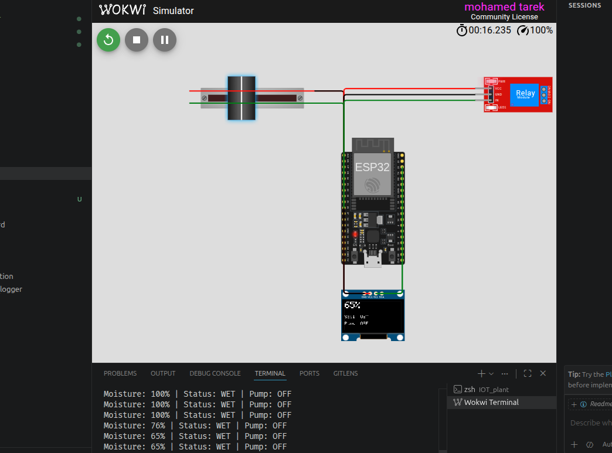

# 🌱 IoT Plant Monitoring System using ESP32

An **IoT-based Plant Monitoring System** built with **ESP32** that continuously monitors soil moisture and automatically controls a water pump through a relay module.

The system displays the current soil moisture percentage, soil condition, and pump status on an **SSD1306 OLED display**. When the soil becomes dry, the relay is activated to simulate turning on a water pump for automatic irrigation.

---

# 📸 Simulation

<p align="center">
  
</p>

> **Note:** Save your Wokwi simulation screenshot as:

```
images/simulation.png
```

---

## 📌 Features

- 🌱 Real-time soil moisture monitoring
- 💧 Automatic irrigation control
- 🔌 Relay-controlled water pump
- 📺 Live moisture percentage displayed on OLED
- 📊 Soil condition classification (Dry, Normal, Wet)
- 🖥️ Serial Monitor logging
- ⚡ Built using the Arduino framework on ESP32
- 🧪 Fully compatible with Wokwi simulation

---

## 🛠 Hardware Components

| Component | Quantity |
|-----------|---------:|
| ESP32 DevKit V4 | 1 |
| SSD1306 OLED Display (I2C) | 1 |
| Soil Moisture Sensor *(Simulated using Potentiometer)* | 1 |
| Relay Module | 1 |

> **Note:**  
> In Wokwi, a **slide potentiometer** is used to simulate the analog output of a soil moisture sensor.

---

## 🔌 Pin Connections

| ESP32 Pin | Connected Device |
|-----------|------------------|
| GPIO 34 | Soil Moisture Sensor (Analog Input) |
| GPIO 26 | Relay Module |
| GPIO 21 | OLED SDA |
| GPIO 22 | OLED SCL |
| 3.3V | OLED, Relay & Soil Sensor |
| GND | Common Ground |

---

## ⚙️ System Operation

The ESP32 continuously reads the analog value from the soil moisture sensor and converts it into a moisture percentage.

The soil condition is classified as:

| Moisture | Soil Status | Pump |
|----------:|-------------|------|
| **< 30%** | 🌵 DRY | ✅ ON |
| **30% – 60%** | 🌿 NORMAL | ❌ OFF |
| **> 60%** | 💧 WET | ❌ OFF |

Whenever the soil becomes **DRY**, the relay is activated to simulate turning on a water pump.

---

## 📺 OLED Display

The OLED displays:

- Soil Moisture Percentage
- Soil Condition
- Pump Status

Example:

```
72%

Soil: WET
Pump: OFF
```

---

## 🖨 Serial Monitor Output

Example:

```
Moisture: 72% | Status: WET | Pump: OFF

Moisture: 18% | Status: DRY | Pump: ON
```

---

## 📁 Project Structure

```
IoT-Plant-Monitor/
│
├── src/
│   └── main.cpp
│
├── images/
│   └── simulation.png
│
├── diagram.json
│
├── platformio.ini
│
└── README.md
```

---

## 📚 Libraries

The project uses the following Arduino libraries:

- Adafruit GFX Library
- Adafruit SSD1306

PlatformIO automatically installs the required libraries:

```ini
lib_deps =
    adafruit/Adafruit GFX Library
    adafruit/Adafruit SSD1306
```

---

## ▶️ Getting Started

### 1. Clone the repository

```bash
git clone https://github.com/yourusername/iot-plant-monitor.git
```

### 2. Open with PlatformIO

Open the project using **Visual Studio Code** with the **PlatformIO** extension installed.

### 3. Build

```bash
pio run
```

### 4. Upload

```bash
pio run --target upload
```

### 5. Monitor Serial Output

```bash
pio device monitor
```

---

## 🧪 Wokwi Simulation

The project includes a complete **diagram.json** file, making it ready to run directly in **Wokwi** without additional configuration.

---

## 🚀 Possible Future Improvements

- Wi-Fi connectivity
- MQTT integration
- Blynk mobile application
- ThingSpeak dashboard
- Cloud data logging
- Mobile notifications
- Weather API integration
- Multiple plant support
- Automatic irrigation scheduling
- Real soil moisture sensor integration
- Water level monitoring
- Solar-powered operation

---

## 🛠 Technologies Used

- ESP32
- Arduino Framework
- PlatformIO
- C++
- I2C Communication
- Wokwi Simulator

---

## 📄 License

This project is intended for educational and learning purposes. Feel free to modify and extend it for your own IoT applications.

---

## 👨‍💻 Author

**Mohamed Tarek**

Engineering Student 