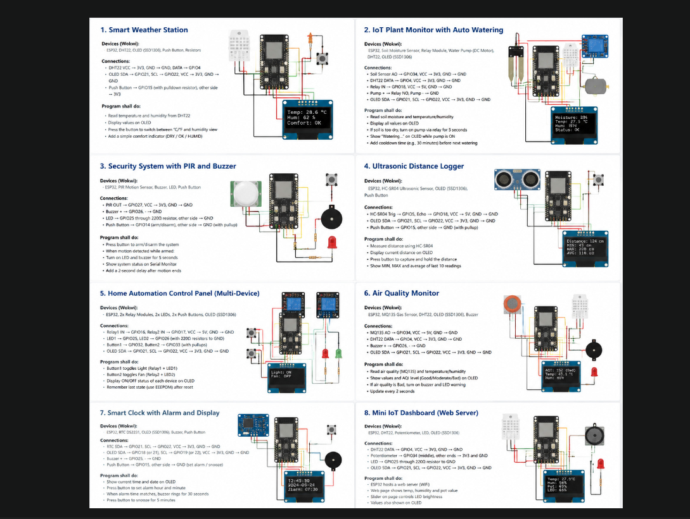

# 🚀 ESP32 IoT Projects Collection

A collection of **ESP32-based IoT projects** developed using the **Arduino Framework**, **PlatformIO**, and **Wokwi Simulator**.

This repository demonstrates practical Internet of Things (IoT) applications, ranging from environmental monitoring and home automation to web servers, MQTT communication, security systems, and smart devices.

Each project is self-contained with its own source code, circuit diagram, documentation, and simulation.

---

# 📸 Projects Overview

<p align="center">
  
</p>

---

# 📂 Repository Structure

```text
ESP32-IoT-Projects/
│
├── Air-Quality-Monitor/
├── Home-Automation/
├── IoT-Plant-Monitor/
├── Mini-IoT-Dashboard/
├── MQTT-Demo/
├── Security-System/
├── Smart-Clock/
├── Smart-Weather-Station/
├── WiFi-Scanner/
│
├── images/
│   └── projects-overview.png
│
└── README.md
```

---

# 📚 Included Projects

| # | Project | Description |
|---|---------|-------------|
| 1 | 🌦️ Smart Weather Station | Displays temperature and humidity with OLED support and Celsius/Fahrenheit switching. |
| 2 | 🌱 IoT Plant Monitor | Monitors soil moisture and automatically controls a water pump using a relay. |
| 3 | 🔐 Security System | Motion detection system using a PIR sensor with LED and buzzer alarm. |
| 4 | 📏 Ultrasonic Distance Logger | Measures distance using an HC-SR04 sensor and displays readings on an OLED. |
| 5 | 🏠 Home Automation | Controls multiple devices using relays, push buttons, EEPROM storage, and an OLED display. |
| 6 | 🌫️ Air Quality Monitor | Detects gas concentration while monitoring temperature and humidity. |
| 7 | ⏰ Smart Clock | RTC-based digital clock featuring alarm, snooze, and OLED display. |
| 8 | 🌐 Mini IoT Dashboard | ESP32 web server displaying live sensor data with remote LED brightness control. |
| 9 | 📡 MQTT Demo | Demonstrates secure MQTT communication between ESP32 and HiveMQ Cloud. |
| 10 | 📶 Wi-Fi Scanner | Scans nearby Wi-Fi networks and displays SSID and RSSI values. |

---

# 🛠 Technologies Used

- ESP32
- Arduino Framework
- PlatformIO
- C++
- Wokwi Simulator
- Wi-Fi Networking
- MQTT
- HTTP Web Server
- I2C Communication
- EEPROM / Preferences
- RTC (DS1307)
- OLED Display (SSD1306)

---

# 🔧 Hardware Used

Across the projects, the following components are utilized:

- ESP32 DevKit V4
- SSD1306 OLED Display
- DHT22 Temperature & Humidity Sensor
- MQ Gas Sensor
- PIR Motion Sensor
- Soil Moisture Sensor
- HC-SR04 Ultrasonic Sensor
- DS1307 RTC Module
- Relay Modules
- LEDs
- Buzzers
- Push Buttons
- Potentiometers
- Resistors

---

# 🎯 Learning Objectives

These projects demonstrate practical implementations of:

- GPIO Programming
- Analog & Digital Sensors
- I2C Communication
- Wi-Fi Networking
- HTTP Web Servers
- MQTT Messaging
- OLED User Interfaces
- Relay Control
- EEPROM / Preferences Storage
- RTC Integration
- Automation Logic
- Embedded C++ Programming
- IoT System Design

---

# ▶️ Getting Started

## 1. Clone the repository

```bash
git clone https://github.com/yourusername/esp32-iot-projects.git
```

## 2. Open any project

Each project is an independent **PlatformIO** project.

Open the desired project folder using **Visual Studio Code** with the PlatformIO extension installed.

## 3. Build

```bash
pio run
```

## 4. Upload

```bash
pio run --target upload
```

## 5. Monitor Serial Output

```bash
pio device monitor
```

---

# 🧪 Simulation

Every project includes a complete **diagram.json** file and can be simulated directly using **Wokwi**.

Each project also contains its own detailed README with:

- Hardware list
- Pin connections
- Features
- Program workflow
- Simulation image
- Future improvements

---

# 📖 Skills Demonstrated

- Embedded Systems Development
- Internet of Things (IoT)
- Sensor Integration
- Real-Time Monitoring
- Automation Systems
- Embedded Web Servers
- MQTT Communication
- Wireless Networking
- User Interface Design
- Hardware Interfacing
- PlatformIO Project Structure
- Arduino Programming

---

# 🚀 Future Projects

Additional projects planned for this repository include:

- Smart Energy Meter
- Smart Door Lock (RFID)
- Smart Parking System
- Smart Irrigation System
- Smart Lighting Controller
- Weather Dashboard with Cloud Integration
- ESP32 Camera Surveillance System
- Telegram Bot Notifications
- Blynk IoT Applications
- Home Assistant Integration
- LoRa Communication Projects
- ESP-NOW Communication
- OTA Firmware Updates

---

# 🤝 Contributions

Contributions, suggestions, and improvements are always welcome.

If you have ideas for new IoT projects or enhancements, feel free to open an issue or submit a pull request.

---

# 📄 License

This repository is intended for educational and learning purposes. Feel free to fork, modify, and build upon these projects.

---

# 👨‍💻 Author

**Mohamed**

Engineering Student | DevOps Engineer | Cybersecurity Enthusiast

⭐ If you find these projects useful, consider giving the repository a star!