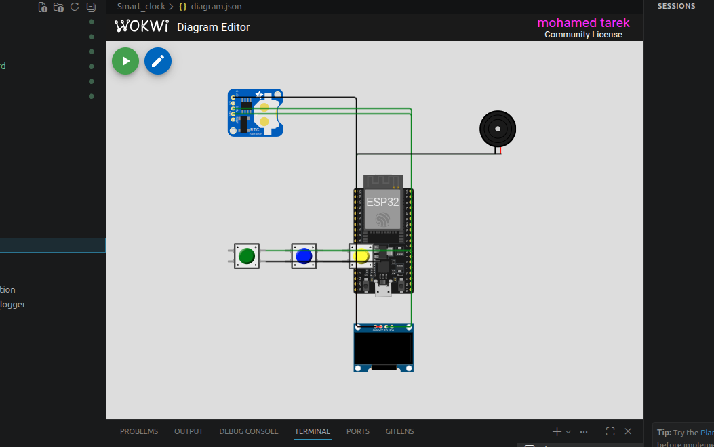

# ⏰ Smart Clock using ESP32

A feature-rich **Smart Clock** built with **ESP32** that combines a **DS1307 Real-Time Clock (RTC)**, an **SSD1306 OLED display**, and an **alarm system** with snooze functionality.

The clock continuously displays the current **time** and **date**, allows users to configure an alarm using push buttons, and triggers a buzzer when the alarm time is reached. The alarm can be **snoozed** with a short button press or **stopped completely** with a long press.

---

# 📸 Simulation

<p align="center">
  
</p>

> **Note:** Save your Wokwi simulation screenshot as:

```
images/simulation.png
```

---

## 📌 Features

- ⏰ Real-time clock using DS1307 RTC
- 📅 Displays current date and time
- 📺 OLED display interface
- 🔔 Configurable alarm
- 😴 Snooze functionality
- 🔕 Long press to stop alarm
- 🎛️ Button-based menu system
- 🔊 Buzzer alarm notification
- 🖥️ Serial Monitor status messages
- ⚡ Built using the Arduino framework on ESP32
- 🧪 Fully compatible with Wokwi simulation

---

## 🛠 Hardware Components

| Component | Quantity |
|-----------|---------:|
| ESP32 DevKit V4 | 1 |
| DS1307 RTC Module | 1 |
| SSD1306 OLED Display (I2C) | 1 |
| Active Buzzer | 1 |
| Push Button | 3 |

---

## 🔌 Pin Connections

| ESP32 Pin | Connected Device |
|-----------|------------------|
| GPIO 21 | RTC SDA & OLED SDA |
| GPIO 22 | RTC SCL & OLED SCL |
| GPIO 25 | Buzzer |
| GPIO 15 | SET Button |
| GPIO 4 | UP Button |
| GPIO 16 | NEXT Button |
| 3.3V | RTC & OLED |
| GND | Common Ground |

---

## ⚙️ System Operation

The Smart Clock continuously reads the current date and time from the **DS1307 RTC** and displays it on the OLED.

Users can configure the alarm using three push buttons:

- **SET Button**
  - Enter or exit alarm setting mode.
  - During an active alarm:
    - **Short press:** Snooze the alarm for 1 minute.
    - **Long press (3 seconds):** Stop the alarm.

- **UP Button**
  - Increase the selected alarm value.

- **NEXT Button**
  - Switch between editing the hour and minute.
  - Save the alarm and exit the setting mode.

---

## 🔔 Alarm Features

The alarm system provides two convenient options when it rings:

### 😴 Snooze

- Activated with a **short press** of the SET button.
- Delays the alarm by **1 minute**.

### 🔕 Stop Alarm

- Activated with a **long press (3 seconds)** of the SET button.
- Stops the alarm completely.

---

## 📺 OLED Display

### Normal Mode

Displays:

- Current Time
- Current Date
- Alarm Time

Example:

```
14:35:28

09/07/2026

Alarm: 07:30
```

---

### Alarm Setting Mode

Displays:

```
SET ALARM

Hour: 07
Minute: 30

Editing Hour
```

or

```
Editing Minute
```

---

## 🖨 Serial Monitor Output

Example:

```
Smart Clock Started

Alarm Saved

Alarm Started

Alarm Snoozed To 07:31

Alarm Started

Alarm Stopped
```

---

## 📁 Project Structure

```
Smart-Clock/
│
├── src/
│   └── main.cpp
│
├── images/
│   └── simulation.png
│
├── diagram.json
│
├── platformio.ini
│
└── README.md
```

---

## 📚 Libraries

The project uses the following Arduino libraries:

- Adafruit GFX Library
- Adafruit SSD1306
- RTClib

PlatformIO automatically installs the required libraries:

```ini
lib_deps =
    adafruit/Adafruit GFX Library
    adafruit/Adafruit SSD1306
    adafruit/RTClib
```

---

## ▶️ Getting Started

### 1. Clone the repository

```bash
git clone https://github.com/yourusername/smart-clock.git
```

### 2. Open with PlatformIO

Open the project using **Visual Studio Code** with the **PlatformIO** extension installed.

### 3. Build

```bash
pio run
```

### 4. Upload

```bash
pio run --target upload
```

### 5. Monitor Serial Output

```bash
pio device monitor
```

---

## 🧪 Wokwi Simulation

The project includes a complete **diagram.json** file, allowing it to run directly in **Wokwi** without additional configuration.

---

## 🚀 Possible Future Improvements

- Wi-Fi time synchronization (NTP)
- Multiple alarms
- Alarm repeat schedule
- Temperature display
- Weather integration
- OLED menu icons
- OLED brightness control
- 12/24-hour display modes
- MQTT integration
- Mobile application support
- Voice assistant integration
- Battery backup monitoring

---

## 🛠 Technologies Used

- ESP32
- Arduino Framework
- PlatformIO
- C++
- DS1307 RTC
- I2C Communication
- OLED Display
- Wokwi Simulator

---

## 📄 License

This project is intended for educational and learning purposes. Feel free to modify and extend it for your own IoT applications.

---

## 👨‍💻 Author

**Mohamed**

Engineering Student | DevOps Engineer 