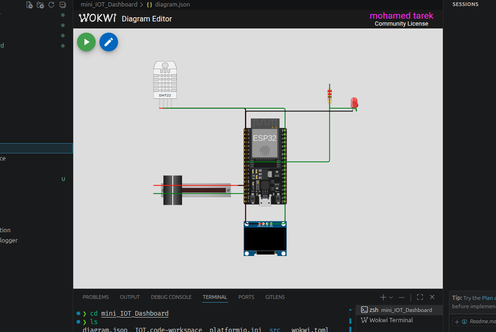

# 📊 Mini IoT Dashboard using ESP32

A compact **IoT Dashboard** built with **ESP32** that combines environmental monitoring, web-based control, and an OLED display into a single project.

The system reads **temperature and humidity** from a **DHT22 sensor**, monitors an analog input using a **potentiometer**, displays real-time information on an **SSD1306 OLED display**, and hosts a **web dashboard** that allows users to control the brightness of an LED directly from their browser.

---

# 📸 Simulation

<p align="center">
  
</p>

> **Note:** Save your Wokwi simulation screenshot as:

```
images/simulation.png
```

---

## 📌 Features

- 🌡️ Real-time temperature monitoring
- 💧 Real-time humidity monitoring
- 🎛️ Analog sensor monitoring (Potentiometer)
- 🌐 Built-in web dashboard
- 💡 Browser-controlled LED brightness
- 📺 Live OLED display
- 📡 Wi-Fi connectivity
- 🖥️ Serial Monitor debugging
- ⚡ Built using the Arduino framework on ESP32
- 🧪 Fully compatible with Wokwi simulation

---

## 🛠 Hardware Components

| Component | Quantity |
|-----------|---------:|
| ESP32 DevKit V4 | 1 |
| DHT22 Temperature & Humidity Sensor | 1 |
| SSD1306 OLED Display (I2C) | 1 |
| Potentiometer *(Analog Input Simulation)* | 1 |
| LED | 1 |
| 220Ω Resistor | 1 |

---

## 🔌 Pin Connections

| ESP32 Pin | Connected Device |
|-----------|------------------|
| GPIO 4 | DHT22 Data |
| GPIO 34 | Potentiometer |
| GPIO 25 | LED |
| GPIO 21 | OLED SDA |
| GPIO 22 | OLED SCL |
| 3.3V | OLED, DHT22 & Potentiometer |
| GND | Common Ground |

---

## 🌐 Web Dashboard

The ESP32 hosts a simple web server that provides a responsive dashboard accessible from any browser on the same network.

The dashboard displays:

- Temperature
- Humidity
- Potentiometer Percentage
- LED Brightness

It also includes an interactive slider to adjust the LED brightness in real time.

---

## ⚙️ System Operation

The ESP32 continuously:

- Reads temperature and humidity from the DHT22 sensor.
- Reads the potentiometer value and converts it to a percentage.
- Updates the OLED display with the latest sensor values.
- Hosts a web page showing live sensor data.
- Receives LED brightness commands from the web interface.
- Adjusts the LED brightness using PWM.

The web page automatically refreshes every **5 seconds** to display updated sensor readings.

---

## 📺 OLED Display

The OLED displays:

- Temperature
- Humidity
- Potentiometer Percentage
- LED Brightness

Example:

```
Temp: 27.4 C
Hum: 54.1%
Pot: 68%
LED: 80%
```

---

## 🌐 Web Dashboard Preview

The dashboard provides:

- Temperature display
- Humidity display
- Potentiometer percentage
- LED brightness indicator
- Interactive brightness slider

Example:

```
Mini IoT Dashboard

Temperature: 27.4 °C

Humidity: 54.1 %

Potentiometer: 68 %

LED Brightness: 80 %

[======== Slider ========]
```

---

## 🖨 Serial Monitor Output

Example:

```
Connecting...

Connected

IP Address:
192.168.x.x

Web Server Started
```

Open the displayed IP address in your browser to access the dashboard.

---

## 📁 Project Structure

```
Mini-IoT-Dashboard/
│
├── src/
│   └── main.cpp
│
├── images/
│   └── simulation.png
│
├── diagram.json
│
├── platformio.ini
│
├── wokwi.toml
│
└── README.md
```

---

## 📚 Libraries

The project uses the following Arduino libraries:

- Adafruit GFX Library
- Adafruit SSD1306
- DHT Sensor Library
- WiFi (ESP32 Arduino Core)
- WebServer (ESP32 Arduino Core)

PlatformIO automatically installs the required libraries:

```ini
lib_deps =
    adafruit/DHT sensor library
    adafruit/Adafruit SSD1306
    adafruit/Adafruit GFX Library
```

---

## ▶️ Getting Started

### 1. Clone the repository

```bash
git clone https://github.com/yourusername/mini-iot-dashboard.git
```

### 2. Open with PlatformIO

Open the project using **Visual Studio Code** with the **PlatformIO** extension installed.

### 3. Build

```bash
pio run
```

### 4. Upload

```bash
pio run --target upload
```

### 5. Monitor Serial Output

```bash
pio device monitor
```

### 6. Open the Dashboard

After the ESP32 connects to Wi-Fi, copy the IP address shown in the Serial Monitor and open it in your web browser.

For Wokwi simulation, the included **wokwi.toml** file forwards:

```
localhost:8080 → ESP32 Port 80
```

Simply open:

```
http://localhost:8080
```

---

## 🧪 Wokwi Simulation

The project includes:

- `diagram.json`
- `wokwi.toml`

allowing the project to run directly in **Wokwi**, including the web dashboard through port forwarding.

---

## 🚀 Possible Future Improvements

- MQTT integration
- Home Assistant support
- ThingSpeak dashboard
- Blynk mobile application
- Historical data logging
- Charts and graphs
- Dark mode interface
- Multiple sensor support
- Relay control
- User authentication
- OTA firmware updates
- Responsive mobile dashboard

---

## 🛠 Technologies Used

- ESP32
- Arduino Framework
- PlatformIO
- C++
- Wi-Fi
- HTTP Web Server
- PWM
- I2C Communication
- Wokwi Simulator

---

## 📄 License

This project is intended for educational and learning purposes. Feel free to modify and extend it for your own IoT applications.

---

## 👨‍💻 Author

**Mohamed Tarek**

Engineering Student | DevOps Engineer 