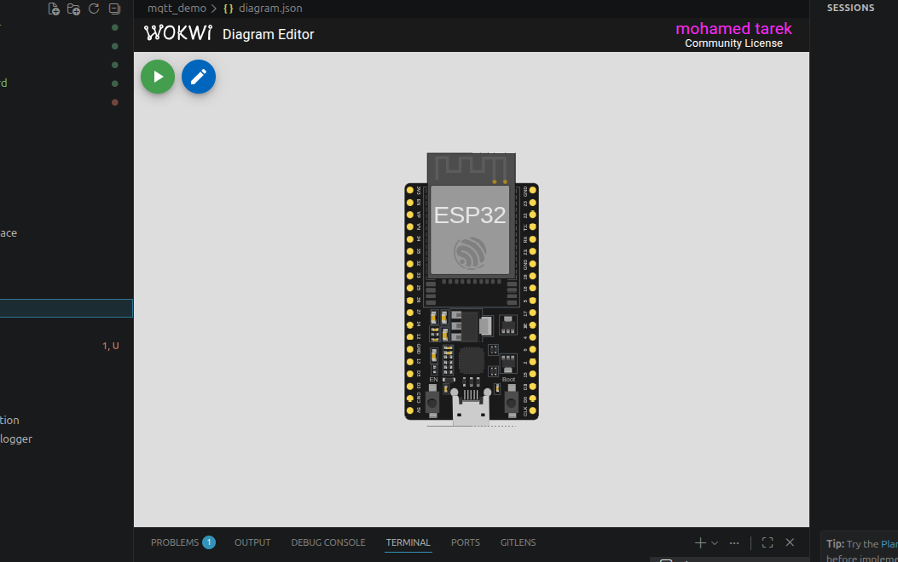

# 📡 MQTT Demo using ESP32 and HiveMQ Cloud

A simple **MQTT communication demo** built with **ESP32** that demonstrates how to securely connect to an **MQTT broker (HiveMQ Cloud)** over TLS, publish messages, and subscribe to a topic.

This project serves as an introduction to the **MQTT publish/subscribe communication model**, making it ideal for learning IoT messaging before building larger cloud-connected applications.

---

# 📸 Simulation

<p align="center">
  
</p>

> **Note:** Save your Wokwi simulation screenshot as:

```
images/simulation.png
```

---

## 📌 Features

- 📶 Connects ESP32 to Wi-Fi
- 🔒 Secure MQTT connection using TLS
- ☁️ Connects to HiveMQ Cloud
- 📤 Publishes a message after connecting
- 📥 Subscribes to an MQTT topic
- 📡 Receives incoming MQTT messages
- 🖥️ Displays MQTT activity in the Serial Monitor
- ⚡ Built using the Arduino framework on ESP32
- 🧪 Fully compatible with Wokwi simulation

---

## 🛠 Hardware Components

| Component | Quantity |
|-----------|---------:|
| ESP32 DevKit V4 | 1 |

> This project does not require external sensors or actuators.

---

## 🔌 Network Architecture

```
           Wi-Fi
             │
             ▼
        ESP32 Device
             │
      Secure TLS (MQTTS)
             │
             ▼
      HiveMQ Cloud Broker
        ▲             ▲
        │             │
   Publish         Subscribe
        │             │
        └─────────────┘
```

---

## ⚙️ System Operation

The ESP32 performs the following steps:

1. Connects to the Wi-Fi network.
2. Establishes a secure TLS connection with HiveMQ Cloud.
3. Authenticates using the configured MQTT username and password.
4. Subscribes to the specified MQTT topic.
5. Publishes a welcome message.
6. Continuously listens for incoming MQTT messages.
7. Prints received messages to the Serial Monitor.

---

## 📤 Published Message

After a successful connection, the ESP32 publishes:

```
Hello from ESP32 via HiveMQ Cloud
```

---

## 📥 Subscribed Topic

The ESP32 subscribes to:

```
mohamed/test
```

Any message published to this topic will immediately appear in the Serial Monitor.

---

## 🖥 Serial Monitor Output

Example:

```
Connecting to WiFi...
....

Connected to WiFi!

Connecting to HiveMQ Cloud...

Connected to HiveMQ Cloud!

Message arrived on topic:
mohamed/test

Message:
Hello from ESP32 via HiveMQ Cloud
```

---

## 📁 Project Structure

```
MQTT-Demo/
│
├── src/
│   └── main.cpp
│
├── images/
│   └── simulation.png
│
├── diagram.json
│
├── platformio.ini
│
└── README.md
```

---

## 📚 Libraries

The project uses the following Arduino libraries:

- PubSubClient
- WiFi (ESP32 Arduino Core)
- WiFiClientSecure (ESP32 Arduino Core)

PlatformIO automatically installs the required MQTT library:

```ini
lib_deps =
    knolleary/PubSubClient
```

---

## ▶️ Getting Started

### 1. Clone the repository

```bash
git clone https://github.com/yourusername/mqtt-demo.git
```

### 2. Open with PlatformIO

Open the project using **Visual Studio Code** with the **PlatformIO** extension installed.

### 3. Configure Your MQTT Credentials

Update the following variables in `main.cpp`:

```cpp
const char* mqtt_server = "your-broker-url";
const char* mqtt_username = "your-username";
const char* mqtt_password = "your-password";
const char* topic = "your/topic";
```

### 4. Build

```bash
pio run
```

### 5. Upload

```bash
pio run --target upload
```

### 6. Monitor Serial Output

```bash
pio device monitor
```

---

## 🧪 Wokwi Simulation

The project includes a complete `diagram.json` file and can be simulated directly in **Wokwi**.

To test MQTT communication:

- Start the simulation.
- Open the Serial Monitor.
- Publish messages to the configured MQTT topic using any MQTT client (such as MQTTX or HiveMQ Web Client).
- Observe incoming messages on the ESP32.

---

## 🚀 Possible Future Improvements

- OLED status display
- LED control via MQTT
- Relay control
- JSON payload support
- Sensor telemetry publishing
- Home Assistant integration
- Node-RED integration
- OTA firmware updates
- Automatic reconnection strategy
- MQTT Last Will and Testament (LWT)
- Retained messages
- Quality of Service (QoS) configuration

---

## 🛠 Technologies Used

- ESP32
- Arduino Framework
- PlatformIO
- C++
- MQTT
- HiveMQ Cloud
- TLS / SSL
- Wi-Fi
- Wokwi Simulator

---

## 📄 License

This project is intended for educational and learning purposes. Feel free to modify and extend it for your own IoT applications.

---

## 👨‍💻 Author

**Mohamed**

Engineering Student | DevOps Engineer 