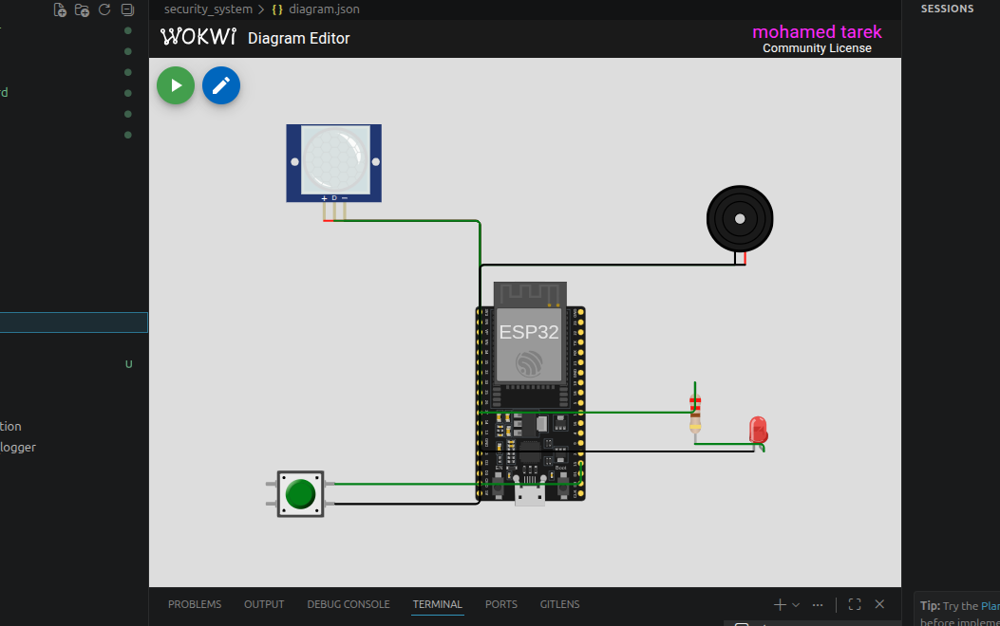

# 🔐 Security System using ESP32

A simple **IoT-based Security System** built with **ESP32** that detects motion using a **PIR motion sensor** and triggers an audible and visual alarm.

The system can be **armed** or **disarmed** using a push button. When armed, any detected motion activates a **buzzer** and a **red LED**, while status updates are displayed through the Serial Monitor.

---

# 📸 Simulation

<p align="center">
  
</p>

> **Note:** Save your Wokwi simulation screenshot as:

```
images/simulation.png
```

---

## 📌 Features

- 🚶 Motion detection using a PIR sensor
- 🔐 Arm/Disarm system using a push button
- 🚨 Audible alarm with buzzer
- 🔴 Visual alarm with LED
- 🖥️ Serial Monitor status updates
- ⚡ Built using the Arduino framework on ESP32
- 🧪 Fully compatible with Wokwi simulation

---

## 🛠 Hardware Components

| Component | Quantity |
|-----------|---------:|
| ESP32 DevKit V4 | 1 |
| PIR Motion Sensor | 1 |
| Active Buzzer | 1 |
| Red LED | 1 |
| Push Button | 1 |
| 220Ω Resistor | 1 |

---

## 🔌 Pin Connections

| ESP32 Pin | Connected Device |
|-----------|------------------|
| GPIO 13 | PIR Motion Sensor |
| GPIO 26 | Buzzer |
| GPIO 27 | LED |
| GPIO 15 | Push Button |
| 3.3V | PIR Sensor |
| GND | Common Ground |

---

## ⚙️ System Operation

The system operates in two modes:

### 🔓 Disarmed Mode

- Motion detection is ignored.
- LED remains OFF.
- Buzzer remains OFF.

### 🔒 Armed Mode

- The PIR sensor continuously monitors movement.
- If motion is detected:
  - The LED turns ON.
  - The buzzer sounds continuously.
  - A motion alert is printed to the Serial Monitor.
- When no motion is detected:
  - The LED turns OFF.
  - The buzzer stops.

The push button toggles between **Armed** and **Disarmed** modes.

---

## 🚨 Alarm Behavior

| System State | Motion | LED | Buzzer |
|--------------|--------|-----|---------|
| Disarmed | No | OFF | OFF |
| Disarmed | Yes | OFF | OFF |
| Armed | No | OFF | OFF |
| Armed | Yes | ON | ON |

---

## 🖨 Serial Monitor Output

Example:

```
Security System Ready
Press button to ARM/DISARM

System ARMED

Motion Detected!

System DISARMED
```

---

## 📁 Project Structure

```
Security-System/
│
├── src/
│   └── main.cpp
│
├── images/
│   └── simulation.png
│
├── diagram.json
│
├── platformio.ini
│
└── README.md
```

---

## ▶️ Getting Started

### 1. Clone the repository

```bash
git clone https://github.com/yourusername/security-system.git
```

### 2. Open with PlatformIO

Open the project using **Visual Studio Code** with the **PlatformIO** extension installed.

### 3. Build

```bash
pio run
```

### 4. Upload

```bash
pio run --target upload
```

### 5. Monitor Serial Output

```bash
pio device monitor
```

---

## 🧪 Wokwi Simulation

The project includes a complete **diagram.json** file, allowing it to run directly in **Wokwi** without additional configuration.

---

## 🚀 Possible Future Improvements

- Wi-Fi notifications
- MQTT integration
- Telegram alerts
- Email notifications
- OLED status display
- RFID or keypad authentication
- Camera integration
- Cloud event logging
- Mobile application
- Home Assistant integration
- Multiple PIR sensors
- Door and window magnetic sensors

---

## 🛠 Technologies Used

- ESP32
- Arduino Framework
- PlatformIO
- C++
- Digital GPIO
- Wokwi Simulator

---

## 📄 License

This project is intended for educational and learning purposes. Feel free to modify and extend it for your own IoT applications.

---

## 👨‍💻 Author

**Mohamed**

Engineering Student | DevOps Engineer |