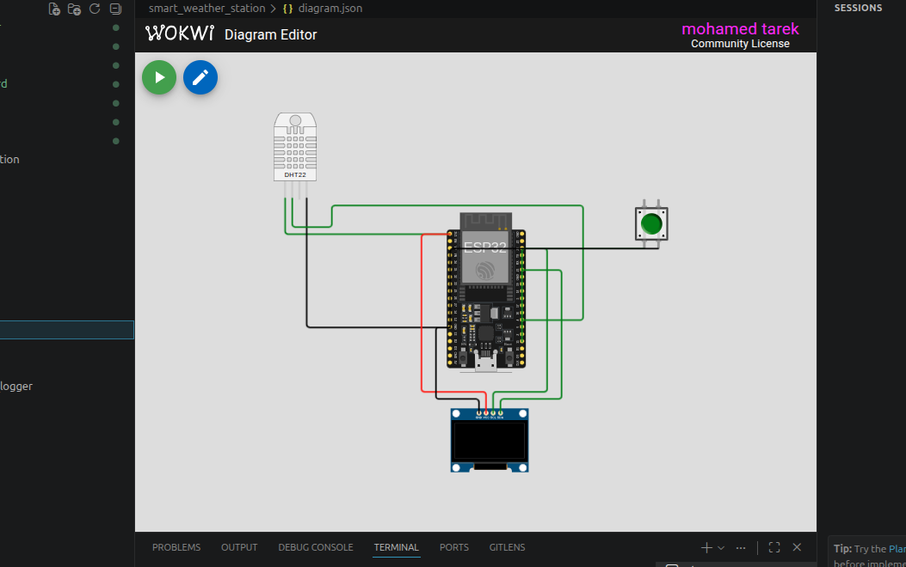

# 🌦️ Smart Weather Station using ESP32

A compact **Smart Weather Station** built with **ESP32** that monitors environmental conditions using a **DHT22 temperature and humidity sensor**.

The system displays real-time weather information on an **SSD1306 OLED display**, allows users to switch between **Celsius** and **Fahrenheit** using a push button, and classifies humidity levels into simple weather conditions for easy interpretation.

---

# 📸 Simulation

<p align="center">
  
</p>

> **Note:** Save your Wokwi simulation screenshot as:

```
images/simulation.png
```

---

## 📌 Features

- 🌡️ Real-time temperature monitoring
- 💧 Real-time humidity monitoring
- 🔄 Switch between Celsius and Fahrenheit
- 📺 Live OLED display
- 🌦️ Weather condition classification
- 🔘 Push-button unit selection
- 🖥️ Serial Monitor logging
- ⚡ Built using the Arduino framework on ESP32
- 🧪 Fully compatible with Wokwi simulation

---

## 🛠 Hardware Components

| Component | Quantity |
|-----------|---------:|
| ESP32 DevKit V4 | 1 |
| DHT22 Temperature & Humidity Sensor | 1 |
| SSD1306 OLED Display (I2C) | 1 |
| Push Button | 1 |

---

## 🔌 Pin Connections

| ESP32 Pin | Connected Device |
|-----------|------------------|
| GPIO 4 | DHT22 Data |
| GPIO 15 | Push Button |
| GPIO 21 | OLED SDA |
| GPIO 22 | OLED SCL |
| 3.3V | DHT22 & OLED |
| GND | Common Ground |

---

## ⚙️ System Operation

The ESP32 continuously performs the following tasks:

1. Reads temperature and humidity from the DHT22 sensor.
2. Calculates both **Celsius** and **Fahrenheit** values.
3. Detects push-button presses to switch between temperature units.
4. Classifies humidity into a weather status.
5. Displays all information on the OLED screen.
6. Sends sensor readings to the Serial Monitor.

---

## 🌦️ Weather Status

The humidity level determines the displayed weather status.

| Humidity | Status |
|----------:|--------|
| **< 30%** | 🌵 DRY |
| **30% – 60%** | ✅ OK |
| **> 60%** | 💧 HUMID |

---

## 🌡️ Temperature Unit Switching

The push button allows users to toggle the displayed temperature between:

- **Celsius (°C)**
- **Fahrenheit (°F)**

The selected unit is shown on both the OLED display and the Serial Monitor.

---

## 📺 OLED Display

The OLED displays:

- Temperature (°C or °F)
- Humidity
- Weather Status

Example:

```
26.8 C

Humidity: 48.5%

Status: OK
```

or

```
80.2 F

Humidity: 48.5%

Status: OK
```

---

## 🖨 Serial Monitor Output

Example:

```
Smart Weather Station Started

Temperature: 26.8 C | Humidity: 48.5% | Status: OK

Button Pressed

Temperature: 80.2 F | Humidity: 48.5% | Status: OK
```

---

## 📁 Project Structure

```
Smart-Weather-Station/
│
├── src/
│   └── main.cpp
│
├── images/
│   └── simulation.png
│
├── diagram.json
│
├── platformio.ini
│
└── README.md
```

---

## 📚 Libraries

The project uses the following Arduino libraries:

- Adafruit GFX Library
- Adafruit SSD1306
- DHT Sensor Library

PlatformIO automatically installs the required libraries:

```ini
lib_deps =
    adafruit/Adafruit GFX Library
    adafruit/Adafruit SSD1306
    adafruit/DHT sensor library
```

---

## ▶️ Getting Started

### 1. Clone the repository

```bash
git clone https://github.com/yourusername/smart-weather-station.git
```

### 2. Open with PlatformIO

Open the project using **Visual Studio Code** with the **PlatformIO** extension installed.

### 3. Build

```bash
pio run
```

### 4. Upload

```bash
pio run --target upload
```

### 5. Monitor Serial Output

```bash
pio device monitor
```

---

## 🧪 Wokwi Simulation

The project includes a complete **diagram.json** file, allowing it to run directly in **Wokwi** without additional configuration.

---

## 🚀 Possible Future Improvements

- Wi-Fi connectivity
- MQTT integration
- ThingSpeak dashboard
- Blynk mobile application
- Weather history logging
- Cloud data storage
- NTP clock integration
- Atmospheric pressure sensor (BMP280/BME280)
- Air quality monitoring
- Weather forecast API integration
- OLED graphical icons
- Mobile notifications

---

## 🛠 Technologies Used

- ESP32
- Arduino Framework
- PlatformIO
- C++
- DHT22 Sensor
- I2C Communication
- OLED Display
- Wokwi Simulator

---

## 📄 License

This project is intended for educational and learning purposes. Feel free to modify and extend it for your own IoT applications.

---

## 👨‍💻 Author

**Mohamed**

Engineering Student | DevOps Engineer | Cybersecurity Enthusiast