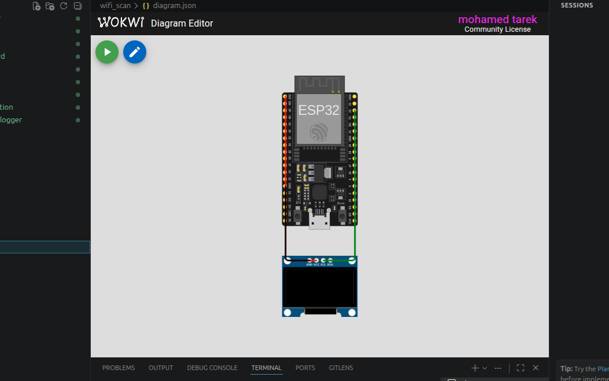

# 📡 Wi-Fi Scanner using ESP32

A simple **Wi-Fi Scanner** built with **ESP32** that scans for nearby wireless networks and displays the results through the **Serial Monitor**.

The project demonstrates how to use the ESP32's built-in Wi-Fi capabilities to discover available access points and retrieve useful information such as the **SSID** (network name) and **RSSI** (signal strength).

---

# 📸 Simulation

<p align="center">
  
</p>

> **Note:** Save your Wokwi simulation screenshot as:

```
images/simulation.png
```

---

## 📌 Features

- 📡 Scan nearby Wi-Fi networks
- 📶 Display signal strength (RSSI)
- 📝 Display network names (SSID)
- ⚡ Uses the ESP32 built-in Wi-Fi module
- 🖥️ Outputs scan results to the Serial Monitor
- 🧪 Fully compatible with Wokwi simulation

---

## 🛠 Hardware Components

| Component | Quantity |
|-----------|---------:|
| ESP32 DevKit V4 | 1 |
| SSD1306 OLED Display (optional in simulation) | 1 |

> **Note:** The current implementation displays scan results only in the **Serial Monitor**. The OLED is connected in the simulation and can be used for future enhancements.

---

## 🔌 Pin Connections

| ESP32 Pin | Connected Device |
|-----------|------------------|
| GPIO 21 | OLED SDA |
| GPIO 22 | OLED SCL |
| 3.3V | OLED VCC |
| GND | OLED GND |

---

## ⚙️ System Operation

When powered on, the ESP32 performs the following steps:

1. Initializes the Serial Monitor.
2. Switches to **Station (STA) mode**.
3. Disconnects from any existing Wi-Fi connection.
4. Scans for nearby wireless networks.
5. Displays each detected network's:
   - SSID (Network Name)
   - RSSI (Signal Strength)

After completing the scan, the program remains idle.

---

## 📶 RSSI (Signal Strength)

RSSI (Received Signal Strength Indicator) is measured in **dBm**.

| RSSI | Signal Quality |
|------:|----------------|
| -30 dBm | Excellent |
| -50 dBm | Very Good |
| -67 dBm | Good |
| -70 dBm | Fair |
| -80 dBm | Weak |
| -90 dBm or lower | Very Weak |

---

## 🖨 Serial Monitor Output

Example:

```text
Scanning...

1: Wokwi-GUEST RSSI=-41
2: Home_WiFi RSSI=-58
3: Office_Network RSSI=-71
4: Mobile_Hotspot RSSI=-83
```

---

## 📁 Project Structure

```text
WiFi-Scanner/
│
├── src/
│   └── main.cpp
│
├── images/
│   └── simulation.png
│
├── diagram.json
│
├── platformio.ini
│
└── README.md
```

---

## ▶️ Getting Started

### 1. Clone the repository

```bash
git clone https://github.com/yourusername/wifi-scanner.git
```

### 2. Open with PlatformIO

Open the project using **Visual Studio Code** with the **PlatformIO** extension installed.

### 3. Build

```bash
pio run
```

### 4. Upload

```bash
pio run --target upload
```

### 5. Open the Serial Monitor

```bash
pio device monitor
```

The available Wi-Fi networks will be listed automatically.

---

## 🧪 Wokwi Simulation

The project includes a complete **diagram.json** file, allowing it to run directly in **Wokwi** without additional configuration.

---

## 🚀 Possible Future Improvements

- Display networks on the OLED screen
- Sort networks by signal strength
- Show encryption type (Open/WPA/WPA2/WPA3)
- Display Wi-Fi channel
- Continuous background scanning
- Export scan results via MQTT
- Host a web interface with scan results
- Save scan history to SPIFFS
- RSSI visualization using graphs
- Filter duplicate SSIDs

---

## 🛠 Technologies Used

- ESP32
- Arduino Framework
- PlatformIO
- C++
- WiFi Library
- Wokwi Simulator

---

## 📄 License

This project is intended for educational and learning purposes. Feel free to modify and extend it for your own IoT applications.

---

## 👨‍💻 Author

**Mohamed**

Engineering Student | DevOps Engineer |